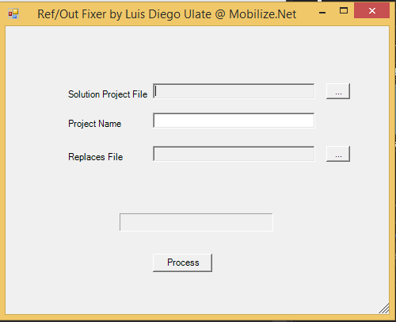

Ref / Out Fixer
================

During WebMap migration, or in general in .Net migrations, Ref/Out parameters can be problematic 
if they are used inside a lambda that is used on async or 'Webmap Promises' blocks.

This is a quick and dirty tool develop by Luis Diego Ulate that 
can be used to help to fix those issues by changing your code after migration.
Luis says please dont judge his coding. 

The tool takes as input a file separated by tabs like the following:

File	Line	Function	
File1.cs	1195	func1	
File1.cs	1195	func2	
File2.cs	1195	func3	
File3.cs	1480	func4	
File4.cs	1480	func5	
File5.cs	4180	func6	
File6.cs	4180	func7

The columns mean:
File: file where the function with issues is defined
Line: current line where the function is defined. it is actually not needed you write any value here
Function: function name	


What the tool does
===================

 public void Class123(ref string assd, out string dd)
        {
            var ssfdsa = new Form1();
            int varPar1 = 8;
            string varPar2 = "8";
            assd = "sdfs";
            dd = "dsfs";
            if (assd == "")
                return;
        }
		
1. An struct is generated called <MethodName>Struct
The struct has a field of each ref or out parameter and if the method returns a value it is also added as `returningValue`
```C#
	public struct Class123Struct
        {
            public string assd;
            public string dd;
        }
```	

2. Modify the method signature to return the new struct.		

3. The return statements are modified to return an instance of <MethodName>Struct

4. All ref and out modified from the method invocations and method declarations are removed.

For the example above we will have:
```C#
     modified return type ==>   
	 public Class123Struct Class123(string assd, string dd)
        {
            var ssfdsa = new Form1();
            int varPar1 = 8;
            string varPar2 = "8";
            assd = "sdfs";
            dd = "dsfs";
            if (assd == "")
                return new Class123Struct() 
                { assd = assd, dd = dd, }; <== modified return
            return new Class123Struct()
            { assd = assd, dd = dd, }; <== modified return
        }
```
		
NOTE: if the method has several overloads then several struct are generated appending a number to `<MethodName>Struct<ConsecutiveNumber>`

Building the tool
=================
Just open the RefOutFixer.sln on VS2015 and rebuild. Some nugets must be installed but VS will do it.

Running the Tool
================



You must provide the absolute path for the solution file and the Csharp project name.
The replaces file must have the format given above.

And example project can be found under the Samples folder

